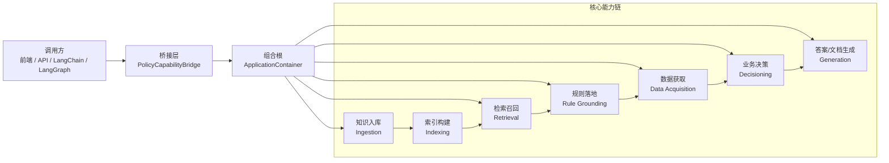
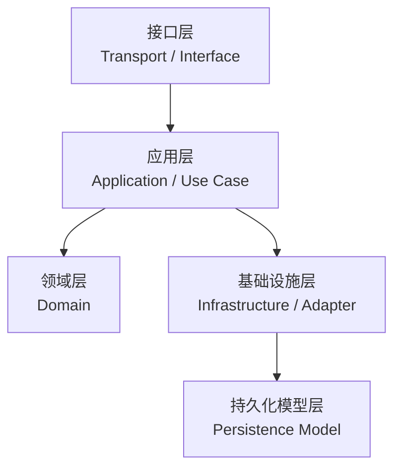
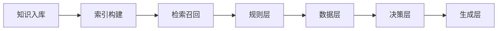
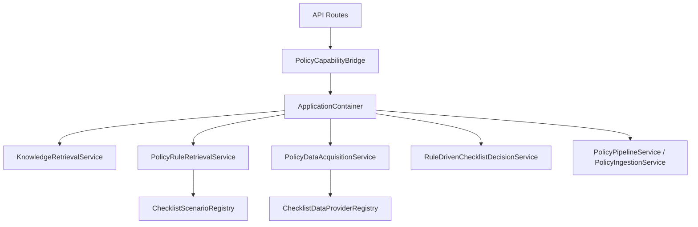
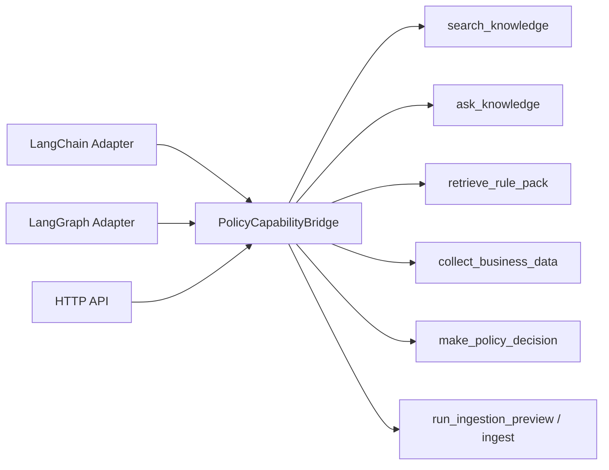
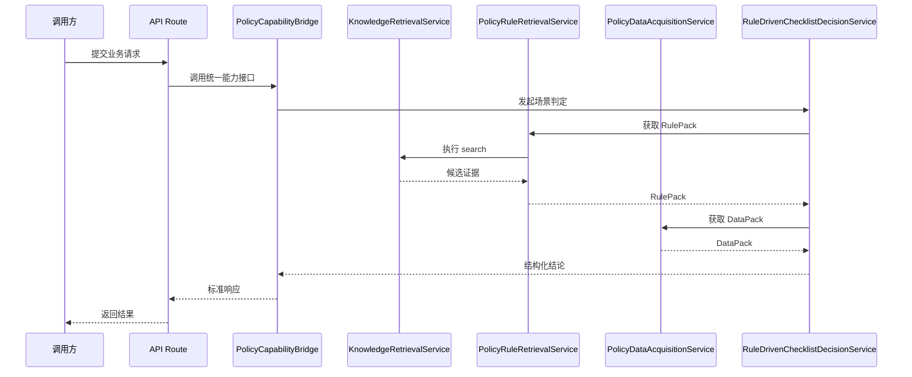
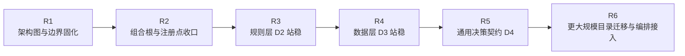

# 架构设计思想

本文档放在仓库根目录，作为当前项目后续演进时的长期参考文献。
它不替代阶段计划文档，而是回答下面几个长期稳定的问题：

- 当前系统到底按什么方式分层
- 知识入库、索引、检索、规则、数据、决策、生成之间如何衔接
- `LangChain` 与 `LangGraph` 后续应该从哪里接入，而不是直接耦合内部实现
- 当前阶段已经落地了什么，后续还应该往哪里演进

本文档的直接前置参考包括：

- `agent.md`
- `docs/当前阶段与下一阶段计划.md`
- `docs/第二阶段-分层架构重设计草案.md`
- `docs/第二阶段-MilestoneD工作计划.md`

---

## 1. 一页结论

当前项目不是单纯的 RAG 问答项目，而是一个正在从“知识检索系统”向“业务 Agent 底座”演进的工程项目。

这套架构的核心结论只有三条：

| 结论 | 含义 | 对当前代码的要求 |
| --- | --- | --- |
| 先稳定核心能力链 | 先把入库、索引、检索、规则、数据、决策这些能力边界站稳 | 不再让路由层和业务层各自散装拼依赖 |
| 再对外标准化暴露 | `LangChain`、`LangGraph`、API 都不应直接依赖内部 service 细节 | 通过桥接层统一暴露能力接口 |
| 增量演进，不大爆炸重构 | 先收口装配、注册点、桥接点，再逐步迁移目录 | 不破坏 `search / ask / ingestion / 当前 PoC` 主链路 |

一句话概括：

> 当前阶段要做的不是“继续往旧结构里堆功能”，而是“先把能力链稳定分层，再让上层编排框架通过桥接层来消费这些能力”。

---

## 2. 系统总图

下面这张图回答“系统整体怎么理解”。

### 图解

- `调用方` 只关心“我能调用什么能力”，不应该关心仓储、规则提取器、Provider 是怎么装配出来的。
- `桥接层` 负责对外暴露稳定接口，是未来 `LangChain / LangGraph` 的统一接入门。
- `组合根` 负责装配所有内部依赖，避免 API route、测试、脚本各自重复 new 一套对象。
- `核心能力链` 是系统真正的中轴线，后续所有业务场景都应该站在这条链上演进，而不是旁路长出新的 PoC 孤岛。

---

## 3. 横向分层图

下面这张图回答“技术上如何分层”。

### 3.1 分层职责表

| 层级 | 主要职责 | 当前主要目录 | 不该承担什么 |
| --- | --- | --- | --- |
| 接口层 | HTTP 路由、参数接收、响应返回、错误映射 | `app/api` | 不写业务规则，不装配复杂依赖 |
| 应用层 | 用例编排、主流程控制、能力组合、分支收口 | `app/services`、`app/application` | 不直接承载底层实现细节 |
| 领域层 | 场景定义、规则模型、决策策略、业务约束 | `app/domain` | 不依赖 HTTP、数据库会话、外部 SDK |
| 基础设施层 | 仓储、OCR、Embedding、LLM、向量检索、外部系统适配 | 目前分散在 `app/repositories` 与 `app/services/*` | 不主导业务决策 |
| 持久化模型层 | ORM、表结构映射、持久化字段定义 | `app/models` | 不承载业务编排逻辑 |

### 3.2 当前阶段的现实说明

当前仓库还没有完全按这个目录形态拆干净，但这不代表没有架构。
更准确地说，当前已经有了“架构方向”，只是很多能力过去是顺着功能迭代自然长出来的，现在需要把它们收回到更稳定的层级边界里。

---

## 4. 纵向能力链图

下面这张图回答“业务能力是怎么串起来的”。

### 4.1 能力域说明表

| 能力域 | 输入 | 输出 | 当前落地点 | 后续扩展点 |
| --- | --- | --- | --- | --- |
| 知识入库 | 制度文档、扫描件、图片 | 可处理文本与切块 | `app/services/ingestion` | 文件源、解析器、OCR、清洗器 |
| 索引构建 | 文本块、结构化章节 | 可检索知识单元 | 当前混在入库与检索之间 | Embedding、索引重建、关键词索引 |
| 检索召回 | 查询语句、过滤条件 | 候选证据集合 | `app/services/retrieval` | 检索策略、融合、重排 |
| 规则层 | 候选证据集合 | `RulePack` | `app/services/policy_rule_retrieval` | 场景注册、规则抽取器、证据充足性策略 |
| 数据层 | 场景请求、业务输入 | `DataPack` | `app/services/policy_data_acquisition` | Provider 注册点、外部系统接入 |
| 决策层 | `RulePack + DataPack` | 结构化业务结论 | `app/services/policy_decision` | 通用决策契约、更多业务场景 |
| 生成层 | 检索/规则/决策结果 | 自然语言回答、摘要、文档 | `app/services/retrieval/answer_service.py` 等 | 模板渲染、文档生成、报告生成 |

### 4.2 为什么规则层和数据层必须单独拿出来

这是当前这轮架构重设计最重要的点。

| 层 | 为什么必须独立出来 | 如果不独立会发生什么 |
| --- | --- | --- |
| 规则层 | 负责把“检索命中的片段”整理成业务可消费的规则包 | 决策层会被迫自己读 chunk、自己猜规则 |
| 数据层 | 负责把“场景所需业务字段”标准化收集成数据包 | 外部系统接入会直接污染决策 service |

这两个中间层站稳之后，后面的业务场景才不会每次都复制一整套 PoC service。

---

## 5. 当前已落地架构图

下面这张图回答“截至当前，代码已经真正落了什么”。

### 5.1 已落地构件表

| 构件 | 作用 | 当前文件 |
| --- | --- | --- |
| `ApplicationContainer` | 统一组合根，收口装配 | `app/application/container.py` |
| `PolicyCapabilityBridge` | 对外桥接层，统一暴露能力 | `app/bridges/policy_capability_bridge.py` |
| `ChecklistScenarioRegistry` | 统一场景注册点 | `app/domain/policy/registry.py` |
| `PolicyRuleRetrievalService` | 检索结果到规则包的中间层 | `app/services/policy_rule_retrieval/service.py` |
| `ChecklistDataProviderRegistry` | 场景到 Provider 的注册点 | `app/services/policy_data_acquisition/registry.py` |
| `PolicyDataAcquisitionService` | 数据获取中间层 | `app/services/policy_data_acquisition/service.py` |
| `RuleDrivenChecklistDecisionService` | 消费规则包和数据包并输出判定 | `app/services/policy_decision/service.py` |

---

## 6. 桥接层设计

下面这张图专门回答“`LangChain` 与 `LangGraph` 应该怎么接”。

### 6.1 桥接层原则

| 原则 | 说明 |
| --- | --- |
| 核心业务层不反向依赖编排框架 | 不能让 `app/services` 或 `app/domain` 直接依赖 `LangChain / LangGraph` |
| 桥接层只做能力暴露和契约转换 | 不把真正业务规则写进桥接层 |
| `LangChain` 与 `LangGraph` 平行接入 | 两者都是桥接层的消费者，不应该互相耦合 |
| 上层只见能力，不见内部实现 | 上层拿到的是 `search / ask / decision`，不是内部 service 拼装细节 |

### 6.2 当前建议对外暴露的能力接口

| 对外能力名 | 当前状态 | 主要用途 |
| --- | --- | --- |
| `search_knowledge` | 已具备 | 检索知识库候选证据 |
| `ask_knowledge` | 已具备 | 先检索再问答 |
| `retrieve_rule_pack` | 已具备 | 从候选证据提炼规则包 |
| `collect_business_data` | 已具备 | 按场景拉取或接收业务字段 |
| `make_policy_decision` | 已具备 PoC 版 | 输出结构化业务结论 |
| `run_ingestion_preview` | 已具备 | 预览入库处理链 |
| `run_ingestion_ingest` | 已具备 | 执行正式入库 |

---

## 7. 关键链路时序图

下面这张图回答“当前 D1/D2/D3 的主流程是怎么串起来的”。

### 7.1 时序图的价值

- `Decision` 不直接处理底层检索细节，而是消费 `RulePack`
- `Decision` 不直接绑定某个具体输入来源，而是消费 `DataPack`
- `Route` 不直接 new 仓储和 service，而是通过桥接层或容器取能力

这三点就是这次重构“真正落地”的标志。

---

## 8. 目录映射表

下面这张表回答“当前目录与目标目录如何对应”。

| 当前目录/模块 | 当前角色 | 目标归属方向 | 备注 |
| --- | --- | --- | --- |
| `app/api` | 接口层 | 保持接口层 | 已开始改为走容器和桥接层 |
| `app/services/ingestion` | 入库编排 + 部分适配实现 | 拆向 `application/ingestion` 与 `infrastructure` | 当前先保持主链可用 |
| `app/services/retrieval` | 检索编排 + 部分适配实现 | 拆向 `application/retrieval` 与 `infrastructure/retrieval` | 当前先保留稳定主链 |
| `app/services/policy_rule_retrieval` | 规则层应用服务 | 对应 `application/rule_retrieval` | D2 已站稳 |
| `app/services/policy_data_acquisition` | 数据层应用服务 | 对应 `application/data_access` | D3 已站稳首版 |
| `app/services/policy_decision` | 决策层编排 | 对应 `application/decision` | 当前仍是单场景 PoC 主入口 |
| `app/domain/policy` | 规则与场景定义 | 保持领域层 | 后续继续沉淀更多场景 |
| `app/repositories` | 数据访问 | 逐步转向基础设施层 | 当前仍可继续沿用 |
| `app/models` | ORM 模型 | 保持持久化层 | 暂不需要大迁移 |
| `app/schemas` | 传输对象与部分内部对象混放 | 后续逐步拆到 `contracts/api` 与 `contracts/dto` | 当前只做约束，不做大迁移 |

---

## 9. 当前阶段状态表

下面这张表回答“哪些已经完成，哪些还在后面”。

| 阶段 | 目标 | 当前状态 | 说明 |
| --- | --- | --- | --- |
| D1 | 收口一个真实 PoC 场景 | 已完成 | 已跑通材料核验最小闭环 |
| D2 | 建立规则层 | 已完成首版 | 已有 `ScenarioRegistry`、`RulePack`、规则获取服务 |
| D3 | 建立数据层 | 已完成首版 | 已有 `DataPack`、Provider 注册点、来源 trace |
| D4 | 通用决策契约 | 进行中/后续继续 | 当前仍以单场景 PoC 决策为主 |
| 桥接层 | 对外暴露标准能力 | 已完成首版 | 已有 `PolicyCapabilityBridge` |
| 组合根 | 统一装配入口 | 已完成首版 | 已有 `ApplicationContainer` |

---

## 10. 当前必须守住的边界

下面这张表回答“后续继续改时，什么不能破坏”。

| 必守边界 | 原因 |
| --- | --- |
| `policy-pipeline` 不破 | 入库链是知识底座，没有它后面全部失效 |
| `retrieval/search` 不破 | 检索链是所有上层能力的共同底盘 |
| `retrieval/ask` 不破 | 问答链是用户最直观看到的能力出口 |
| 当前已跑通的决策 PoC 不破 | 它是规则层和数据层的验收主链 |
| 桥接层对外契约尽量稳定 | 这是后续接 `LangChain / LangGraph` 的基准面 |

---

## 11. 本轮明确不做的事

为了避免这份架构文档变成“无边界的大重构宣言”，下面这些事情当前不作为立刻执行项：

| 当前不做 | 原因 |
| --- | --- |
| 一次性重命名全部目录 | 风险高，收益低 |
| 一次性拆完全部 `schemas` | 当前先守主链，不做大爆炸迁移 |
| 立刻接入全部真实外部系统 | 数据层注册点已预留，后续逐步接入 |
| 立刻完整引入 `LangChain / LangGraph` 编排 | 先站稳桥接层，再接上层框架 |
| 为了“架构好看”重写成熟主链 | 当前目标是落地，不是展示型重构 |

---

## 12. 后续演进路线图

### 12.1 路线图说明表

| 阶段 | 重点 | 本质目标 |
| --- | --- | --- |
| R1 | 先把架构图和边界讲清楚 | 统一团队认知 |
| R2 | 先收口装配、注册点、桥接点 | 防止能力继续散装扩张 |
| R3 | 规则层正式化 | 让检索结果变成业务规则包 |
| R4 | 数据层正式化 | 让业务输入来源可替换、可追踪 |
| R5 | 决策契约通用化 | 让更多业务场景复用同一条链 |
| R6 | 目录进一步迁移、接入编排框架 | 在稳定边界上继续工程化 |

---

## 13. 一句话总结

当前项目后续应该围绕下面这条主线推进：

> 先把“知识入库、索引、检索、规则、数据、决策、生成”放回稳定分层架构，再通过 `ApplicationContainer + PolicyCapabilityBridge` 把这些能力标准化暴露给 API、`LangChain` 和 `LangGraph`。

换句话说：

**当前最重要的不是继续堆功能，而是先把能力链、装配点、桥接点、注册点站稳。**
