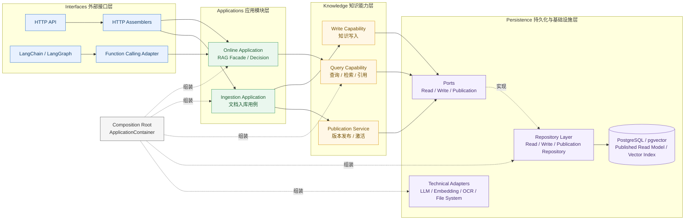
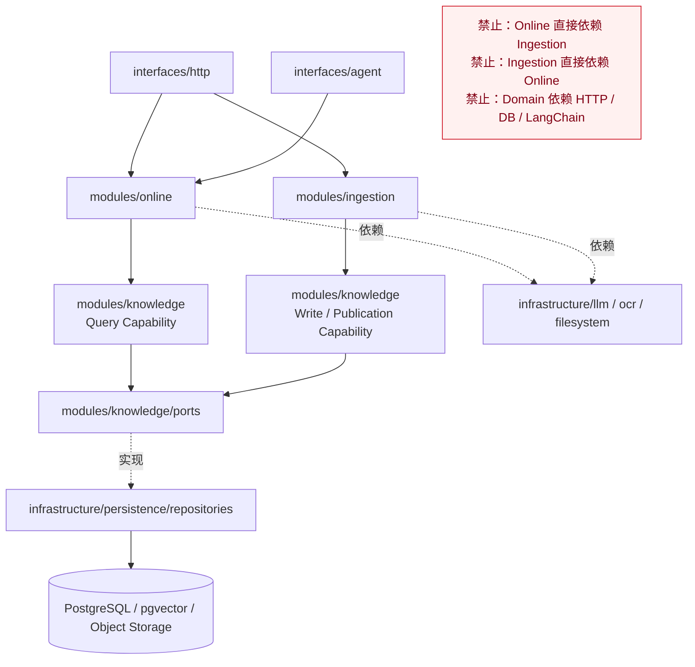
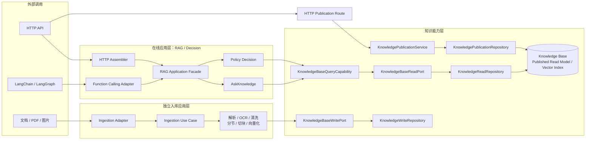

# 当前架构基准

## 最终结构图



## 当前物理目录结构

```text
app/
├── modules/                              # 三大业务模块总包
│   ├── online/                           # 在线 RAG / Decision
│   │   ├── application/
│   │   │   ├── rag_facade.py
│   │   │   ├── ask_knowledge.py
│   │   │   └── policy_decision.py
│   │   ├── domain/
│   │   │   ├── checklist/
│   │   │   │   ├── definitions.py
│   │   │   │   └── registry.py
│   │   │   └── decision_result.py
│   │   └── contracts.py
│   │
│   ├── knowledge/                        # 知识能力层
│   │   ├── application/
│   │   │   ├── query_capability.py
│   │   │   ├── publication_service.py
│   │   │   └── write_capability.py
│   │   ├── domain/
│   │   │   ├── knowledge_version.py
│   │   │   └── publication_state.py
│   │   ├── ports/                         # 仓储抽象与能力端口
│   │   │   ├── read_port.py
│   │   │   ├── write_port.py
│   │   │   └── publication_port.py
│   │   └── retrieval/
│   │       ├── pipeline.py
│   │       ├── policies.py
│   │       ├── rerank.py
│   │       └── vector_search.py
│   │
│   └── ingestion/                        # 独立文档入库层
│       ├── application/
│       │   ├── ingestion_use_case.py
│       │   └── scan_candidates.py
│       ├── domain/
│       │   └── policies.py
│       ├── ports/
│       │   ├── file_port.py
│       │   ├── embedding_port.py
│       │   └── ocr_port.py
│       └── pipeline/
│           ├── pipeline.py
│           ├── context.py
│           ├── persistence.py
│           └── steps/
│
├── interfaces/                           # 外部接口层
│   ├── http/                             # 给前端的 HTTP API
│   │   ├── routes/
│   │   ├── assemblers/
│   │   └── schemas/
│   └── agent/                            # LangChain / LangGraph
│       ├── function_calling_adapter.py
│       └── contracts.py
│
├── infrastructure/                       # 基础设施具体实现
│   ├── persistence/
│   │   ├── repositories/                  # 仓储层具体实现
│   │   │   ├── knowledge_read_repository.py
│   │   │   ├── knowledge_write_repository.py
│   │   │   └── knowledge_publication_repository.py
│   │   ├── models/                        # ORM 持久化模型
│   │   └── session.py
│   ├── llm/
│   │   ├── llm_client.py
│   │   └── embedding_client.py
│   ├── ocr/
│   │   └── tencent_ocr.py
│   └── filesystem/
│       ├── policy_file_service.py
│       └── upload_service.py
│
├── composition/                          # Composition Root
│   ├── root.py
│   ├── online.py
│   ├── knowledge.py
│   └── ingestion.py
│
└── shared/                               # 少量公共基础类型
    ├── exceptions.py
    ├── identifiers.py
    └── events.py
```

## 关键边界图



## 核心调用关系图



## Checklist 与 RAG 的架构对应

Checklist 场景属于 `modules/online/domain/checklist`，负责场景定义、规则要求和输入材料核验；它不直接实现 RAG，也不直接访问数据库或具体 Repository。

Checklist 通过 `modules/online/application/rule_retrieval` 调用 Knowledge Query Capability，使用 `modules/knowledge/retrieval` 提供的召回、融合、rerank 和来源追踪能力，得到规则证据包后再进行领域判断。

具体场景的新增方式和各层职责见 `docs/Checklist场景与RAG检索扩展说明.md`。
