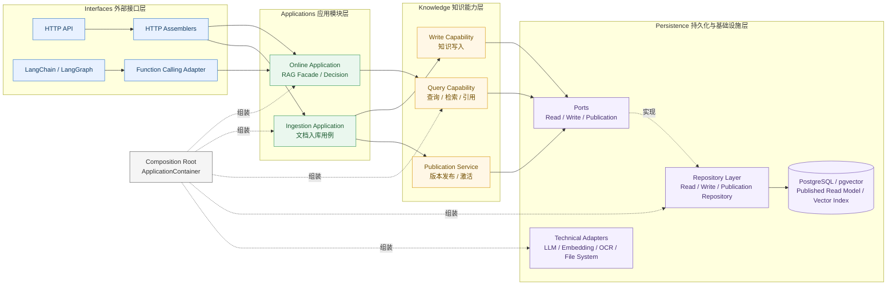
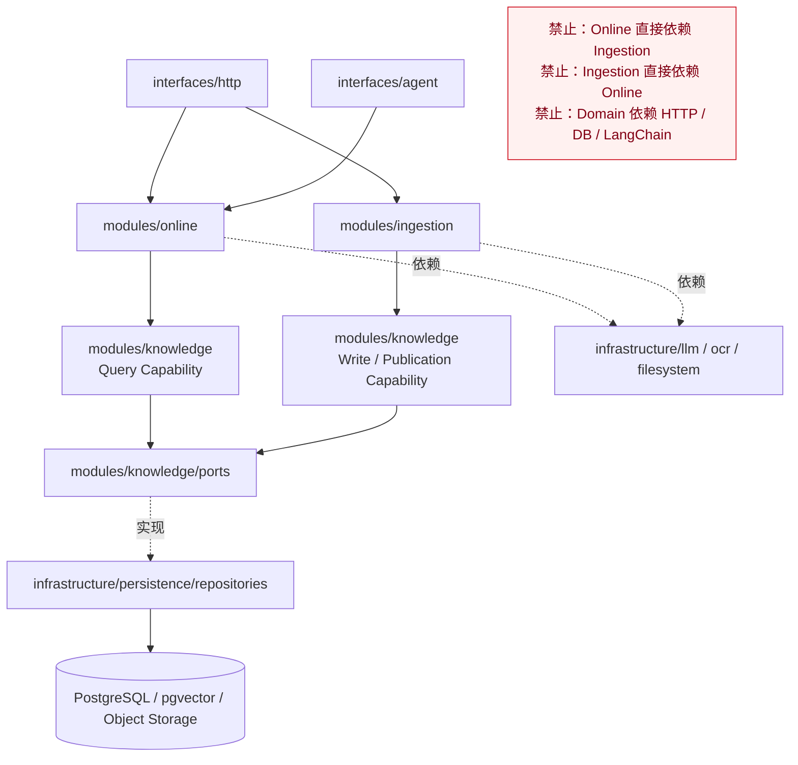
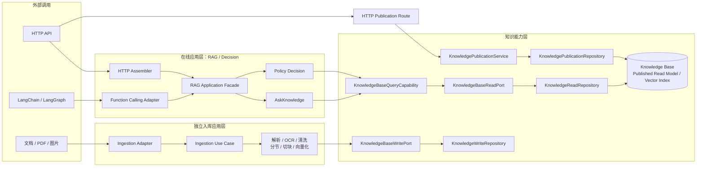

# 当前架构基准

## 最终结构图



## 当前物理目录结构

```text
app/
├── modules/                              # 三大业务模块总包
│   ├── online/                           # 在线 RAG / Decision
│   │   ├── application/
│   │   │   ├── rag_facade.py
│   │   │   ├── ask_knowledge.py
│   │   │   └── policy_decision.py
│   │   ├── domain/
│   │   │   ├── checklist/
│   │   │   │   ├── definitions.py
│   │   │   │   └── registry.py
│   │   │   └── decision_result.py
│   │   └── contracts.py
│   │
│   ├── knowledge/                        # 知识能力层
│   │   ├── application/
│   │   │   ├── query_capability.py
│   │   │   ├── publication_service.py
│   │   │   └── write_capability.py
│   │   ├── domain/
│   │   │   ├── knowledge_version.py
│   │   │   └── publication_state.py
│   │   ├── ports/                         # 仓储抽象与能力端口
│   │   │   ├── read_port.py
│   │   │   ├── write_port.py
│   │   │   └── publication_port.py
│   │   └── retrieval/
│   │       ├── pipeline.py
│   │       ├── policies.py
│   │       ├── rerank.py
│   │       └── vector_search.py
│   │
│   └── ingestion/                        # 独立文档入库层
│       ├── application/
│       │   ├── ingestion_use_case.py
│       │   └── scan_candidates.py
│       ├── domain/
│       │   └── policies.py
│       ├── ports/
│       │   ├── file_port.py
│       │   ├── embedding_port.py
│       │   └── ocr_port.py
│       └── pipeline/
│           ├── pipeline.py
│           ├── context.py
│           ├── persistence.py
│           └── steps/
│
├── interfaces/                           # 外部接口层
│   ├── http/                             # 给前端的 HTTP API
│   │   ├── routes/
│   │   ├── assemblers/
│   │   └── schemas/
│   └── agent/                            # LangChain / LangGraph
│       ├── function_calling_adapter.py
│       └── contracts.py
│
├── infrastructure/                       # 基础设施具体实现
│   ├── persistence/
│   │   ├── repositories/                  # 仓储层具体实现
│   │   │   ├── knowledge_read_repository.py
│   │   │   ├── knowledge_write_repository.py
│   │   │   └── knowledge_publication_repository.py
│   │   ├── models/                        # ORM 持久化模型
│   │   └── session.py
│   ├── llm/
│   │   ├── llm_client.py
│   │   └── embedding_client.py
│   ├── ocr/
│   │   └── tencent_ocr.py
│   └── filesystem/
│       ├── policy_file_service.py
│       └── upload_service.py
│
├── composition/                          # Composition Root
│   ├── root.py
│   ├── online.py
│   ├── knowledge.py
│   └── ingestion.py
│
└── shared/                               # 少量公共基础类型
    ├── exceptions.py
    ├── identifiers.py
    └── events.py
```

## 关键边界图



## 核心调用关系图



## HTTP 交互契约与适配边界

HTTP 接口不仅是能力的暴露入口，也是前端与应用层之间的交互契约。此前架构图已经定义了 HTTP Route、Assembler、Application 和 Port 的调用关系，但没有明确 Request Body、Query、Path Parameter 与 Response Body 的归属。本节补充这一部分。

### HTTP 交互链条

```text
前端
  -> HTTP Request
  -> interfaces/http/routes
  -> interfaces/http/schemas
  -> interfaces/http/assemblers
  -> Application Command / Query
  -> Capability / Use Case
  -> Port
  -> Repository / Provider

Repository / Provider
  -> Application Result
  -> interfaces/http/assemblers
  -> interfaces/http/schemas
  -> HTTP Response
  -> 前端
```

HTTP 层负责协议适配，不负责业务编排。Application 层负责用例编排，不依赖 FastAPI、`Request`、`Response`、`UploadFile` 或 HTTP Schema。Domain 层不依赖 HTTP、数据库、Repository 或具体基础设施实现。

### 对象归属规则

| 对象 | 所属位置 | 职责 | 约束 |
|---|---|---|---|
| Request Body | `app/interfaces/http/schemas/` | 定义 JSON / multipart 请求结构和边界校验 | 不直接传入 Application |
| Query / Path 参数 | `app/interfaces/http/schemas/` 或 Route 参数 | 定义分页、筛选、资源 ID 等 HTTP 输入 | 复杂查询应定义独立 Schema |
| Response Body | `app/interfaces/http/schemas/` | 定义返回给前端的协议结构 | 不直接使用 ORM Model 或 Domain Entity |
| HTTP Assembler | `app/interfaces/http/assemblers/` | Request Schema 与 Application Command/Query 互转；Application Result 与 Response Schema 互转 | 不实现业务规则 |
| Application Command / Query | `app/modules/*/application/` | 描述一个用例的内部输入 | 不依赖 HTTP 层类型 |
| Application Result | `app/modules/*/application/` | 描述一个用例的内部输出 | 可以作为 HTTP、Agent 等多个适配器的输入 |
| Capability / Use Case | `app/modules/*/application/` | 编排业务流程并调用 Port | 不直接访问数据库或 HTTP |
| Port | `app/modules/*/ports/` | 定义应用层所需的读写能力 | 由 Infrastructure 实现 |
| Domain Entity / Value Object | `app/modules/*/domain/` | 承载领域状态和业务不变量 | 不添加页面展示字段 |

同一个业务结果如果同时被 HTTP 和 Agent 使用，应共享 Application Result，但分别建立 HTTP Assembler 和 Agent Adapter；不能让 Agent 或前端直接复用对方的协议 Schema。

### 知识库管理交互的推荐结构

知识库管理页面属于 HTTP 应用交互，不等同于底层知识检索能力。管理页面需要的统计、文档列表和文档详情属于管理读模型，应通过 Application Query 和 Read Port 提供。

```text
app/interfaces/http/
├── routes/
│   ├── knowledge_management.py
│   └── ingestion_retry.py
├── schemas/
│   ├── knowledge_management.py
│   └── ingestion_retry.py
└── assemblers/
    ├── knowledge_management.py
    └── ingestion_retry.py

app/modules/knowledge/application/
├── management_contracts.py
└── management_service.py

app/modules/knowledge/ports/
└── management_read_port.py

app/modules/ingestion/application/
└── retry_ingestion.py
```

推荐的边界如下：

```text
KnowledgeDocumentListRequest
  -> ListKnowledgeDocumentsQuery
  -> KnowledgeManagementService
  -> ManagementReadPort
  -> KnowledgeReadRepository
  -> KnowledgeDocumentListResult
  -> KnowledgeDocumentListResponse
```

`KnowledgeDocumentListResponse` 可以包含 `file_name`、`file_size`、`processing_status`、`processing_progress`、`chunk_count`、`updated_at` 和 `error_message` 等前端字段；这些字段属于 HTTP Read Model，不应直接加入 Domain Entity。

### 上传、入库与发布交互

上传交互由多个 HTTP 用例组成，不应把一次上传请求伪装成一个同步的“文档创建”接口：

```text
POST /api/v1/kb/policy-pipeline/preview-upload
  -> PolicyUploadPreviewRequest / multipart boundary
  -> IngestionUseCase.preview()
  -> PolicyUploadPreviewResponse

用户确认
  -> PolicyUploadIngestRequest
  -> POST /api/v1/kb/policy-pipeline/ingest-upload
  -> IngestionUseCase.ingest()
  -> PolicyPipelineResponse

入库成功
  -> KnowledgePublicationRequest
  -> POST /api/v1/kb/publication/activate
  -> KnowledgePublicationService.publish()
  -> KnowledgePublicationResponse
```

文件流、`UploadFile` 和临时上传 ID 只停留在 HTTP / Upload Adapter 边界；Application 只接收已经转换后的上传命令或可解析的文件引用。

### 检索交互

检索和问答接口复用已有 Knowledge Query Capability，不因前端工作台增加新的检索算法入口：

```text
RetrievalSearchRequest
  -> KnowledgeQuery
  -> KnowledgeBaseQueryCapability
  -> KnowledgeQueryResult
  -> RetrievalSearchResponse
```

HTTP 响应中的 `hits`、`citations` 和 `debug` 是接口展示契约；检索内部的召回、融合、rerank 和追踪对象仍属于 `modules/knowledge/retrieval`，不得由前端或 HTTP Route 直接拼装。

### 当前接口补充原则

1. 已有能力优先复用：检索、问答、上传预览、正式入库、版本发布继续使用现有 Application Capability。
2. 缺失内容优先补 HTTP Schema、Assembler、Route 和必要的 Application Query/Command，不重写底层算法。
3. 管理概览、文档列表、文档详情属于新的 Application Read Model，不修改为 Domain 对象。
4. 现有 `/api/v1/kb/documents` 是制度下拉列表契约；正式管理列表应新增独立的管理响应契约，避免破坏已有调用方。
5. 文档重试属于 `modules/ingestion/application` 的入库用例，HTTP 路由只是外部适配入口，不将重试逻辑放入 `modules/knowledge/domain`。

## Checklist 与 RAG 的架构对应

Checklist 场景属于 `modules/online/domain/checklist`，负责场景定义、规则要求和输入材料核验；它不直接实现 RAG，也不直接访问数据库或具体 Repository。

Checklist 通过 `modules/online/application/rule_retrieval` 调用 Knowledge Query Capability，使用 `modules/knowledge/retrieval` 提供的召回、融合、rerank 和来源追踪能力，得到规则证据包后再进行领域判断。

具体场景的新增方式和各层职责见 `docs/Checklist场景与RAG检索扩展说明.md`。
