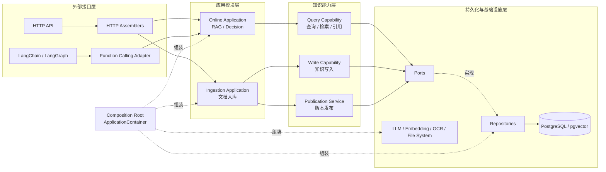

## 项目定位

Bid Document Agent 当前围绕三类核心能力建设：

1. 知识文档入库
2. 基于知识库的检索与问答
3. 面向业务场景的规则判断 PoC

项目不把 LLM 作为唯一核心，而是优先建设：

```text
文档进入
  -> 解析与清洗
  -> 章节与切块
  -> 向量化与持久化
  -> 检索与证据定位
  -> 规则与业务数据处理
  -> 可解释结果输出
```

## 当前状态

| 阶段 | 状态 |
|---|---|
| Agent Phase 1：Retrieval-grounded MVP | 已完成 |
| Milestone A：检索底座增强 | 已完成 |
| Milestone B：混合检索与 rerank | 已完成 |
| Milestone C：HNSW 与性能准备 | 已完成 |
| Milestone D / D1：规则场景 PoC | 已完成 |
| Milestone D / D2：规则获取抽象 | 已完成 |
| Milestone D / D3：数据获取抽象 | 已完成 |
| Milestone D / D4：结果生成链路 | 已完成 |
| Milestone D / D5：PoC 验收与回归资产 | 已完成 |
| Milestone E：知识库收尾 | 已完成 |

当前项目处于：

> Agent Phase 3：招标书驱动的投标书应用

当前重点仍是单场景、可解释、可验证的业务闭环，不追求一次性构建完整多场景 Agent。

## 核心能力

| 核心能力 | 定位 | 能力明细 |
|---|---|---|
| 文档入库 | 支持文档从接入到知识库写入的完整流程 | 文件登记与准入校验<br>DOC / DOCX / PDF / 图片处理<br>文档解析与 OCR<br>文本清洗<br>章节拆分<br>Chunk 切分<br>Embedding 生成<br>文档、版本、章节、切块持久化<br>预览与正式入库分离 |
| 知识检索 | 由知识模块统一负责检索链路 | 向量召回<br>关键词召回<br>双路结果融合<br>结果去重<br>启发式 rerank<br>最低分过滤<br>召回来源追踪<br>阶段调试信息输出<br>Exact / HNSW 向量策略切换 |
| RAG 问答 | 在线应用层提供统一的 RAG 外观 | `search`：只执行知识检索<br>`ask`：先检索，再基于命中证据生成回答<br>返回引用文档、版本、章节、页码和原文片段<br>无有效证据时拒绝生成无依据结论 |
| 业务规则判断 | 已完成“委托评估机构申请材料核验”规则驱动 PoC | 规则获取<br>材料数据获取<br>领域规则匹配<br>缺失材料识别<br>引用证据输出<br>`pass / fail / insufficient_evidence` 结构化结果<br>调试信息和来源追踪 |
| Agent 接入边界 | 预留 LangChain / LangGraph 的 Function Calling 接入边界；当前阶段只提供稳定的能力接口，不提前引入复杂 Agent 编排 | `LangChain / LangGraph` → `Function Calling Adapter` → `AskKnowledgeUseCase` → `RAG Application Facade` → `Knowledge Query Capability` |

## 目标架构



完整架构说明见 `ARCHITECTURE.md`。

## 物理结构

```text
app/
├── modules/
│   ├── online/              # 在线 RAG 与业务决策
│   ├── knowledge/           # 知识查询、写入与发布能力
│   └── ingestion/           # 独立文档入库能力
├── interfaces/
│   ├── http/                # HTTP 路由、Schema、Assembler
│   └── agent/               # Function Calling Adapter
├── infrastructure/
│   ├── persistence/         # ORM、Session、Repository
│   ├── llm/                 # LLM 与 Embedding 适配器
│   ├── ocr/                 # OCR 适配器
│   └── filesystem/          # 文件系统与上传暂存
├── composition/             # Composition Root
└── shared/                  # 配置、日志、异常与共享基础类型

tests/
├── architecture/           # 架构边界与包结构测试
├── application/            # 应用层、规则和数据获取测试
├── ingestion/              # 文档入库、OCR、上传测试
├── knowledge/              # 检索、评测与 fixtures
├── infrastructure/         # 数据库和外部适配器测试
└── support/                # 公共测试工具
```

## 架构原则

> **统一依赖方向：** 接口层 → 应用层 → 知识 / 领域能力 → Ports ← 基础设施实现。具体适配器只在 Composition Root 中组装。

| 架构原则 | 核心约束 | 落地方式 |
|---|---|---|
| 应用模块与知识能力分离 | 应用模块只依赖稳定的知识能力，不感知底层实现 | 在线应用通过知识查询能力完成检索，不直接访问数据库、向量索引或具体检索策略；入库应用通过知识写入能力完成持久化，不直接依赖具体 Repository |
| HTTP Schema 与内部契约分离 | HTTP 请求和响应模型只存在于接口层，应用层不依赖 FastAPI 或前端结构 | Assembler 负责 `HTTP Schema → Command` 和 `Result → HTTP Response` 的双向转换 |
| 仓储通过 Ports 抽象 | 端口由内层定义，实现由外层提供 | 知识模块定义读取、写入和发布端口；基础设施层实现这些端口，数据库、ORM 和 pgvector 细节不得泄漏到领域层和应用层 |
| Composition Root 统一组装 | 具体实现的选择和对象依赖关系集中在唯一入口 | `ApplicationContainer` 统一组装 Repository、LLM Client、Embedding Client、OCR Service、File Service 和 Application Use Case |
| 工程边界持续有效 | 项目规模不影响工程质量要求 | 保持模块职责清晰、输入输出可验证、关键链路可测试、结果来源可追踪、敏感数据不进入测试目录、外部依赖可替换、架构可持续演进 |

## 本地运行

### 环境要求

- Python 3.11+
- Node.js / npm
- Docker Desktop
- PostgreSQL + pgvector

### 安装后端依赖

```bash
python -m venv .venv
pip install -r requirements-dev.txt
```

Windows PowerShell：

```powershell
.venv\Scripts\Activate.ps1
```

### 配置环境变量

```powershell
Copy-Item .env.example .env
```

至少需要根据实际环境配置：

- `DATABASE_URL` 或 PostgreSQL 分项配置
- `GITEE_API_KEY`
- `ZHIPU_API_KEY`
- 腾讯 OCR 相关配置

敏感配置只允许保存在 `.env`，禁止提交到 Git。

### 启动 PostgreSQL

```bash
docker compose --env-file .env -f docker/postgres/docker-compose.yml up -d
```

### 启动后端

```bash
uvicorn app.main:app --reload
```

后端地址：

- `http://127.0.0.1:8000`
- `http://127.0.0.1:8000/docs`

### 启动前端

```bash
cd frontend
npm install
npm run dev
```

## HTTP API

当前主要接口：

| 能力 | 方法 | 路径 |
|---|---|---|
| 检索 | POST | `/api/v1/kb/retrieval/search` |
| RAG 问答 | POST | `/api/v1/kb/retrieval/ask` |
| 业务规则判断 | POST | `/api/v1/kb/policy-decisions/court-evaluation-materials/review` |
| 文档扫描 | POST | `/api/v1/kb/policy-ingestion/scan` |
| 入库预览 | POST | `/api/v1/kb/policy-pipeline/preview` |
| 文件上传预览 | POST | `/api/v1/kb/policy-pipeline/preview-upload` |
| 文档入库 | POST | `/api/v1/kb/policy-pipeline/ingest` |
| 暂存文件入库 | POST | `/api/v1/kb/policy-pipeline/ingest-upload` |
| 知识版本发布 | POST | `/api/v1/kb/publication/activate` |

## 测试与质量检查

运行全部后端测试：

```bash
python -m pytest -q
```

运行代码检查：

```bash
ruff check app tests
python -m compileall -q app tests
```

构建前端：

```bash
cd frontend
npm run build
```

执行知识库只读审计：

```bash
python -m app.scripts.run_knowledge_base_audit
```

审计只读取数据库并输出资料、版本、解析状态和质量问题，不执行清理或改写。

当前测试覆盖：

- 架构依赖边界
- Composition Root 组装
- 入库流水线
- OCR 与文件解析
- 上传暂存安全
- 知识检索
- 融合与 rerank
- Exact / HNSW 策略
- 数据库 Repository
- 规则获取与业务决策
- RAG 外观层
- Embedding 适配器

## 数据与安全边界

- 训练数据、业务敏感文档和 OCR 输出不进入 `tests/`
- 运行时文件写入 `.runtime/`
- 上传暂存具备大小限制、ID 校验、路径隔离和过期清理
- `.env` 不提交到 Git
- 测试优先使用匿名样例、内存数据和 mock
- 真实外部服务只通过基础设施适配器接入

## 项目路线

> **演进路径：** 检索与入库底座 → 单场景规则 PoC → 结果生成通用化 → 多场景 Agent 能力。

| 路线阶段 | 状态 | 主要交付 / 目标 |
|---|---|---|
| 检索与入库底座 | 已完成 | RAG 最小闭环<br>文档入库链路<br>混合检索与 rerank<br>HNSW 策略准备 |
| 架构边界建设 | 已完成 | Online / Knowledge / Ingestion 架构拆分<br>Repository 与 Ports 抽象 |
| Milestone D / D1-D3 | 已完成 | 规则场景 PoC<br>规则获取抽象<br>数据获取抽象 |
| Milestone D / D4 | 已完成 | 结果生成链路通用化<br>第二场景复用验证<br>保持规则、数据和结果之间的可解释性 |
| Milestone D / D5 | 已完成 | 固定 PoC 样例<br>自动化回归与 API Smoke<br>架构边界治理<br>机测、人测和全量验证 |
| Milestone E | 已完成 | 只读知识库审计<br>资料质量问题清单<br>检索与引用来源追溯<br>Phase 2 收尾 |
| 多场景与 Agent 演进 | 后续规划 | 扩展第二类业务规则场景<br>接入真实业务数据 Provider<br>引入 LangChain / LangGraph 编排<br>支持更多 Agent 工具调用能力<br>扩展历史案例、模板和文档生成能力 |

## 相关文档

- `ARCHITECTURE.md`：当前架构基准
- `agent.md`：协作与工程开发约定
- `docs/当前阶段与下一阶段计划.md`：整体阶段规划与 Phase 3 交接边界
- `docs/第三阶段工作计划.md`：Phase 3 详细工作计划与验收标准
- `docs/Phase3业务扩展风险与技术债参考.md`：Phase 3 扩展风险与技术债参考
- `sql/README-policy-schema.md`：知识库表结构设计
- `tools/ocr/README.md`：OCR 与样本分类工具说明

## 项目声明

这是一个个人学习与工程实践项目。

项目会持续通过真实问题、架构演进、测试验证和阶段性复盘进行完善。当前实现以可验证 PoC 和工程结构建设为主，不代表已经达到生产环境完整可用标准。
